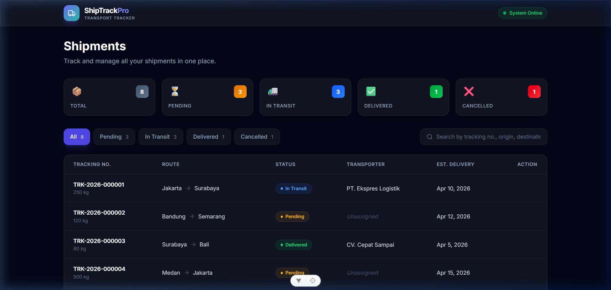
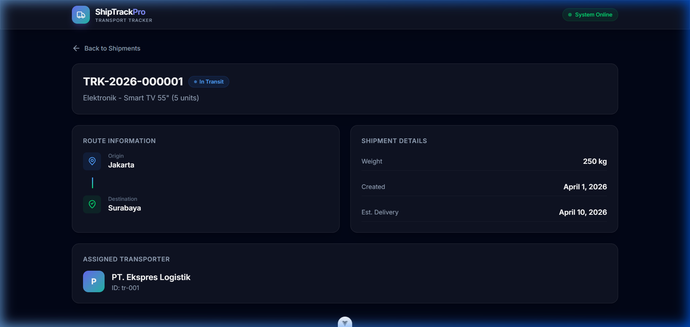

# 🚛 Transport Shipment Tracker

A modern web application to track, manage, and assign transporters to shipments in real-time.  
Built with **Vue 3 Composition API**, **Pinia**, and **TailwindCSS v4** — powered by a fully mocked REST API using **Mirage.js**.

---

## 📸 Screenshots

### Shipment List (Dashboard)

> The main dashboard shows all shipments in a responsive table with status filters, search, and summary stats.



### Shipment Detail

> Clicking a shipment reveals detailed route information, shipment metadata, and the assigned transporter.



---

## ✨ Features

| # | Feature | Description |
|---|---------|-------------|
| 1 | **Shipment List** | View all shipments in a responsive table (desktop) or card list (mobile) with real-time filtering and search. |
| 2 | **Shipment Detail** | View detailed information including route, weight, dates, and assigned transporter. |
| 3 | **Assign Transporter** | Assign an available transporter to a pending shipment via a validated modal form. |
| 4 | **Status Filtering** | Filter shipments by status: All, Pending, In Transit, Delivered, Cancelled. |
| 5 | **Global Search** | Search shipments by tracking number, origin, destination, or description. |
| 6 | **Toast Notifications** | Visual feedback for success/error actions (e.g., transporter assignment). |
| 7 | **Mock API** | Fully simulated REST API with realistic latency, validation, and HTTP status codes. |
| 8 | **Delivery Performance** | Automatically tracks and categorizes if a shipment is delivered early, on-time, or late. |
| 9 | **Realtime Simulation** | Simulates active shipment routes locally and automatically transitions statuses in real-time. |
| 10 | **Dark / Light Mode** | Seamless, responsive dark and light mode theme using Tailwind CSS variants. |

---

## 🛠️ Tech Stack

| Category | Technology | Purpose |
|----------|-----------|---------|
| **Core Framework** | [Vue 3](https://vuejs.org/) (Composition API + `<script setup>`) | UI framework with modern reactive patterns |
| **Build Tool** | [Vite](https://vite.dev/) | Lightning-fast HMR and build tooling |
| **State Management** | [Pinia](https://pinia.vuejs.org/) | Intuitive, type-safe store management |
| **Routing** | [Vue Router 4](https://router.vuejs.org/) | SPA page navigation |
| **Styling** | [TailwindCSS v4](https://tailwindcss.com/) | Utility-first CSS framework |
| **Mock API** | [Mirage.js](https://miragejs.com/) | Client-side API mocking with latency simulation |
| **Form Validation** | [VeeValidate](https://vee-validate.logaretm.com/) + [Yup](https://github.com/jquense/yup) | Declarative schema-based form validation |
| **UI Feedback** | [vue-toastification](https://vue-toastification.maronato.dev/) | Elegant toast notifications |
| **Unit Testing** | [Vitest](https://vitest.dev/) + [Vue Test Utils](https://test-utils.vuejs.org/) | Fast unit testing integrated with Vite |
| **Language** | [TypeScript](https://www.typescriptlang.org/) | Static type checking |

---

## 📁 Project Structure

```
src/
├── __tests__/                    # Unit test files
│   └── shipment.store.spec.ts    # Pinia store tests (9 test cases)
│
├── assets/
│   └── main.css                  # TailwindCSS v4 config + design tokens
│
├── components/                   # Reusable UI components
│   ├── AssignTransporterModal.vue # Modal with VeeValidate + Yup validation
│   ├── SearchBar.vue             # Search input component
│   ├── ShipmentTable.vue         # Responsive table/card list
│   ├── StatsCards.vue            # Dashboard stat summary cards
│   ├── StatusBadge.vue           # Color-coded status indicator
│   └── StatusFilter.vue          # Tab-style status filter buttons
│
├── router/
│   └── index.ts                  # Route definitions
│
├── server/
│   └── index.ts                  # Mirage.js mock API server + seed data
│
├── stores/
│   └── shipment.ts               # Pinia store (state, getters, actions)
│
├── types/
│   └── index.ts                  # TypeScript interfaces & types
│
├── views/
│   ├── ShipmentDetailView.vue    # Shipment detail page
│   └── ShipmentListView.vue      # Shipment list (dashboard) page
│
├── App.vue                       # Root component with layout & navigation
└── main.ts                       # App entry point & plugin registration
```

---

## 🚀 Getting Started

### Prerequisites

- **Node.js** `>=20.19.0` or `>=22.12.0`
- **npm** `>=10`

### Installation

```bash
# 1. Clone the repository
git clone https://github.com/your-username/transport-shipment-tracker.git
cd transport-shipment-tracker

# 2. Install dependencies
npm install

# 3. Start the development server
npm run dev
```

The app will be available at **http://localhost:5173/**

### Available Scripts

| Script | Description |
|--------|-------------|
| `npm run dev` | Start Vite dev server with HMR |
| `npm run build` | Type-check and build for production |
| `npm run preview` | Preview production build locally |
| `npm run test:unit` | Run unit tests with Vitest |
| `npm run lint` | Lint source files (OxLint + ESLint) |
| `npm run format` | Format source files with Prettier |

---

## 🔌 Mock API Endpoints

Mirage.js intercepts the following API routes during development:

| Method | Endpoint | Description | Response |
|--------|----------|-------------|----------|
| `GET` | `/api/shipments` | List all shipments | `200` — Array of shipments |
| `GET` | `/api/shipments/:id` | Get shipment by ID | `200` / `404` |
| `PATCH` | `/api/shipments/:id/assign` | Assign transporter to shipment | `200` / `400` / `404` |
| `GET` | `/api/transporters` | List all transporters | `200` — Array of transporters |

### Assignment Validation Rules

- Transporter must exist and be **available** (`isAvailable: true`)
- Shipment status must be **Pending** or **In Transit** (cannot assign to Delivered/Cancelled)
- On successful assignment, shipment status changes to **In Transit**

---

## 🧪 Testing

```bash
# Run all unit tests
npm run test:unit

# Run tests in watch mode
npx vitest

# Run with coverage
npx vitest --coverage
```

### Test Coverage

| Module | Test Cases | Status |
|--------|-----------|--------|
| Shipment Store — Initial state | 1 | ✅ Pass |
| Shipment Store — Filter by status | 2 | ✅ Pass |
| Shipment Store — Assign transporter logic | 2 | ✅ Pass |
| Shipment Store — Search query | 1 | ✅ Pass |
| Shipment Store — Status counts | 1 | ✅ Pass |
| Shipment Store — Available/Unassigned metrics | 2 | ✅ Pass |

---

## 📝 Commit Convention

This project follows [Conventional Commits](https://www.conventionalcommits.org/) specification:

```
<type>(<scope>): <description>

[optional body]
```

| Type | Description |
|------|-------------|
| `feat` | A new feature |
| `fix` | A bug fix |
| `docs` | Documentation changes |
| `style` | Code style changes (formatting, no logic change) |
| `refactor` | Code refactoring (no feature/fix) |
| `test` | Adding or updating tests |
| `chore` | Build process, tooling, or dependency updates |

---

## 📄 License

This project is created for assessment/evaluation purposes.

---

<p align="center">
  Built with ❤️ using Vue 3 + Vite + TailwindCSS
</p>
